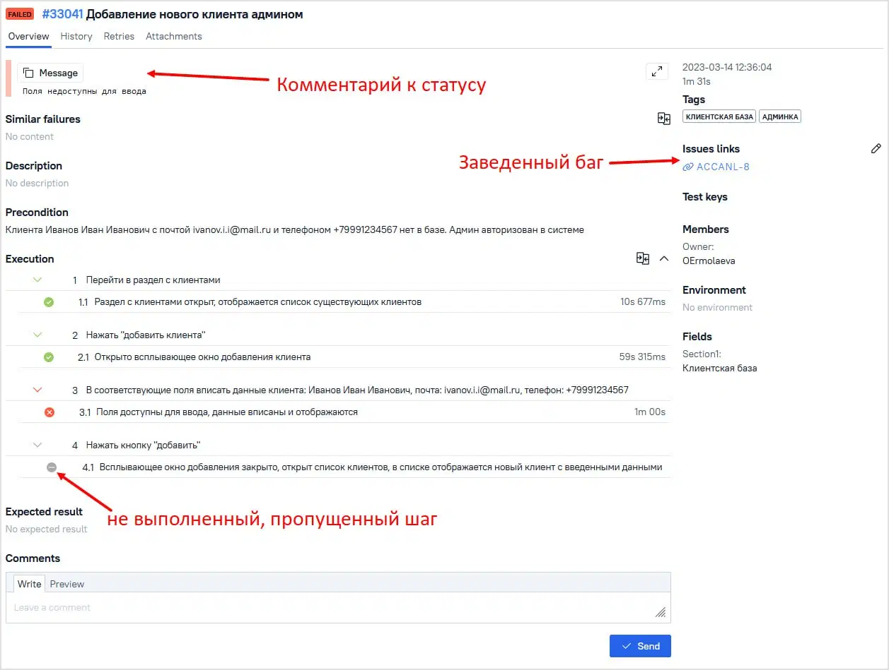
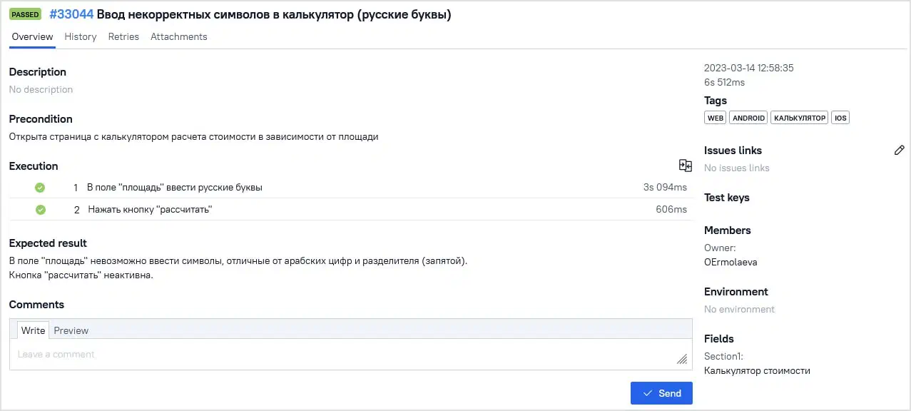
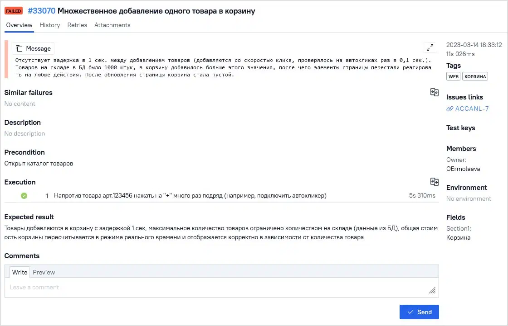

## Тест кейсы

Тест-кейс — это форма записи проверки, которую проводит тестировщик. По сути, это алгоритм действий, по которому предполагается тестировать уже написанную программу. В нём подробно прописаны шаги, которые нужно сделать для подготовки к тесту, сама проверка и ожидаемый результат.

Тест-кейс — достаточно подробная инструкция. Обычно форма тест-кейса чёткая и строгая, с конкретной структурой, и в нём обязательно прописаны тестовые данные для проверки, шаги, предварительные условия и ожидаемый результат.

## Регрессивное тестирование

Основные функции системы следует проверять в каждой новой версии — это называется регрессионное тестирование.

## Чек листы

Чек-лист гораздо короче, он описывает, что именно нужно проверить, без конкретных данных и шагов.

Таким образом, чек-листы подходят, если система не очень сложная, а тестированием занимаются специалисты, вовлечённые в продукт. Если система многокомпонентная, проверки требуют сложных условий, а тестировать продукт будут менее вовлечённые в него люди, лучше потратить время на тест-кейсы.

## Виды тест‑кейсов

Существует три вида тест-кейсов:

#### 1. Позитивные, или положительные. 

Проверяют, что система адекватно реагирует на корректные данные. Например, если при регистрации ввести в поле логина существующий, корректно написанный email, ещё не зарегистрированный в системе, сайт поймёт это правильно и допустит регистрацию.

#### 2. Негативные, или отрицательные. 

Показывают, что система умеет работать с некорректными данными. Например, если не написать в email значок @ или пропустить точку, сайт сообщит об ошибке и не допустит регистрацию.

#### 3. Деструктивные. 

Служат для проверки прочности системы. Например, позволяют убедиться, что в поле для email нельзя ввести команду, которая удалит базу данных зарегистрированных пользователей.

## Атрибуты тест‑кейса

Тест-кейсы принято оформлять по определённому стандарту. Поэтому каждый тест-кейс состоит из нескольких чётких элементов — атрибутов:

### Уникальный номер. 

Это может быть любая нумерация, принятая в проекте. Он позволит ссылаться на определённые тесты по номеру.

### Заголовок. 

Кратко, но ёмко описывает конкретную цель тест-кейса ― что именно нужно проверить. 

### Предусловия. 

Условия, которые нужно соблюсти перед началом тест-кейса. Как правило, нужно авторизоваться или находиться в определённом разделе программы.

### Окружение. 

Где именно работал тестировщик: на каком устройстве, в каком браузере. Иногда его заполняют до тестирования, чтобы указать, на каком именно оборудовании и ПО его проходить. Иногда — после, и тогда тестировщик сам указывает, в каком окружении работал.

### Постусловия. 

Действия, которые нужно проделать после проведения проверки. Этот пункт встречается редко, но иногда он необходим. Например, может понадобиться удалить внесённые данные, чтобы они не скапливались в базе.

### Шаги. 

Последовательность шагов, которую нужно проделать для проверки.

### Ожидаемый результат тест-кейса. 

То, что тестировщик должен получить от системы после или во время прохождения шагов.

### Статус. 

Passed/Failed, то есть Успех/Провал или другой. Его заполняет тестировщик из заранее определённых вариантов, принятых в команде.

### Фактический результат тест-кейса. 

То, что получилось после выполнения шагов тест-кейса. Часто этого поля нет, и фактический результат описывают в баг-репорте в случае статуса failed.

## Примеры

Рассмотрим несколько тест-кейсов разных типов.

### Позитивный

Здесь рассмотрим тест-кейс, в котором есть ожидаемый результат после каждого шага. Для этого снова опишем добавление клиента в базу, но на этот раз более подробно.

### Негативный

Теперь рассмотрим тест-кейс для сайта с калькулятором стоимости, в который тестировщик попытается ввести буквы вместо цифр.

### Деструктивный

Теперь опишем тест-кейс сценария, который потенциально может нарушить работу сайта.

